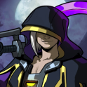

# Bouran, the Shadow

- Prism: Heart
- Stature: Lean and composed, standing about 1.72m tall.
- Personality: Reserved, severe, and distant, but capable of real compassion.
- Motivation: To defend the natural cycle of life and death and punish those who corrupt it.
- Relationship: Raised by Allbane; distrusted by many, but helped by many more.

## Backstory

Bouran is a Heart-aligned OpenSky shaped by the darkest regions of Sky rather than by
civil society. Found as a child in the Undercroft with the Heart Prism already in their
hands, Bouran grew up in a place where survival, decay, and endurance were impossible
to romanticize. That upbringing gave them an unusually stark understanding of life,
death, and the cost of disturbing either.

Unlike gentler healers, Bouran treats mercy and violence as part of the same duty. They
protect those whose time has not come, heal when healing preserves the proper order, and
eliminate threats when that same order is being defied or perverted. This makes Bouran
frightening to outsiders, but not cruel. They are a defender of balance, not merely a
harbinger of death.

## Additional Details

- Raised and instructed by Allbane after being found alone in the Undercroft.
- Trained alongside Exo and Revenants, which shaped both their worldview and aesthetic.
- Has likely held their Prism longer than almost any active OpenSky besides figures like
  Lotus or Banjo.
