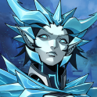

# Cryogen, Elemental Dragon of Water

### The Accursed Queen of the North

- Quote: "In my embrace, you will never know death."
- Personality: Fanatical, Driven, Egotistical and Unflinching in her 'Duty'.
- Motivation: To freeze all life in the Sky with her icy breath 'preserving' it for eternity.
- Relationship: Distrusted by her fellow dragons, feared by many, worshipped by a cult surrounding her that believes in the 'immortality' she offers.

## Additional Details

- The closest to an 'evil' dragon, though still not truly evil.
- Has a fanatical desire to "preserve" all life within Sky.
- Her breath puts the living in a state of suspended animation.
- By encasing them in ice, she will allow them to "live" forever.
- Has a cult of followers that try to aid in her mission.
- Used to be a caring dragon that was more 'water' based.
- Her Grief as millions died while she was immortal drove her mad.
- Some say it "froze her heart," leading to her current mission.
- Does not see herself as a villain, but the savior of all.
- "I give immortality - what gift could be greater?"
