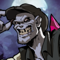

# Gerry

Gerry the Goon is a brash, boisterous zomboid bruiser who lives for noise, momentum,
and the chance to settle a problem with his fists.

- Personality: Loud, aggressive, swaggering, and always eager to escalate.
- Motivation: To win respect, dominate the street in front of him, and prove that nobody hits harder.
- Relationship: Commands a small ragtag army of followers who seem to admire him, fear him, or both.

## Backstory

Gerry is not subtle. He barrels through scenes like a riot given a name, turning every
confrontation into a performance of intimidation, bravado, and sudden violence. He carries
himself like someone who expects a fight at any moment and would be disappointed not to
get one.

What makes him more than a common thug is scale. Gerry does not just throw punches
himself; he leads a scrappy band of loyal misfits who follow him into brawls, schemes, and
territory disputes. That gives him the feel of a local warlord in miniature: not polished,
not noble, but dangerous because his chaos comes with numbers.

His role in the setting works best when he is treated as a street-level force of disruption.
Where larger powers wage ideological wars or mythic struggles, Gerry represents the kind
of immediate physical threat that can take over an alley, a district, or a gathering simply
through volume, momentum, and fear.
