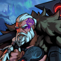

# Horik, the Exile

- Prism: Strength + Heart
- Quote: "I won't bow to Fate. It will bow to me."
- Age: 48 | Height: 1.92m | Weight: 94kg
- Personality: Lonely wolf, Guilt-ridden, Honorable and Brave.
- Motivation: Go back in time and save his son.
- Relationship: Always lonely.

### Backstory

Many years ago, he was an honourable leader of his tribe, living in the mountain lands far up north. One day, the Glitch's storm arrived, a violent Entropy Tornado. Many people under his protection disappeared that day, including his young son, along with Horik's Left arm as he tried to hold onto his son. Being one of the few survivors, he took full responsibility and was wracked with guilt over what happened, vowing to do everything in his power to reclaim what he'd lost. Years later, he heard rumours about a mysterious artifact that could grant him a wish to turn back time and save his son. Now, he is on a quest to find this device, determined to get it at any cost, and ready to fight anyone who opposes his way.

### Additional Details

- Hated the civilized world before the tragedy, sworn to live in peace and harmony with his community, but also unable to ask for help. Perhaps he was too stubborn to heed the warning about the Glitch Storm.
- Idea: Son might still be alive as a "new" creature. (Maybe an Oasis/Tree) Like, he goes to the tree and grieves.
- After the Glitch Storm, all that was left of his city, friends, and son was an acorn. Horik, on his hands and knees sobbing, punches the ground, leaving a massive crater. We see the wind roll the acorn into the hole left behind by his blow. A tear falls from his eye onto the acorn, and it sprouts a tiny leaf. Horik picks it up and turns to throw it off the mountainside, but instead, he turns back, deciding there was too much lost that day. As he goes to place it back in the dirt where it was, he sees the beautiful red and purple prism gem in the dirt. As he grabs the stone, it sinks into his hand, giving him the will to tie up his wound and start walking.
- I like the idea that Horik was the original STR weaver, and when he decides to "Retire" to be with his family, he gives the STR gem to Ada for her quest to help those who can't protect themselves. Horik could have thought that he finally achieved peace for his village before this "Natural" disaster hit his village and ultimately sparked his desire to bring his son back to life. His strength, grief, and insurmountable passion to resurrect his son give him the Str/Hrt gem.
