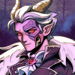

# Undragon, Elemental Dragon of Dark

### The concept of death made manifest

- Quote: "We all belong to death."
- Stature: A colossal dark dragon stretching roughly 70 feet in length.
- Personality: Stoic, severe, and almost impersonal in its cruelty and restraint.
- Motivation: The Undragon appears to act according to a logic few others can interpret.
- Relationship: Feared by mortals, hated by many dragons, and especially loathed by Kha Meth.

## Backstory

The Undragon is less like a ruler and more like a principle given form. It may have existed before Sky itself, a being so old and alien
that even the other dragons prefer to deny or avoid it rather than understand it.

Where other dragons can still be read as patrons, tyrants, parents, or guardians, the
Undragon is closer to inevitability. Famine, disease, decline, and endings gather around
it. Yet the source stops short of calling it simply evil. It can ruin lives, but it can also stay
its hand, make pacts, or operate by standards no one fully understands.

## Additional Details

- Said to dwell deep in the Undercroft.
- Offers pacts involving knowledge or power at prices that vary wildly.
- Its moral logic is opaque: some believe it punishes the wicked, others believe the
  opposite.
- Its true name is unknown, which reinforces its role as an archetype rather than a person.
