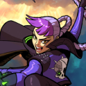

# Zoey, the Maverick

- Prism: Agility + Heart
- Quote: "Life is fleeting. Don't waste a moment of it!"
- Age: 25 | Height: 1.68m | Weight: 54kg
- Personality: Bold, impulsive, defiant, and darkly funny.
- Motivation: To break oppressive systems and defend the freedom of people cast aside by them.
- Relationship: Allied with Iris, friendly with Samya, and antagonistic toward Armis and its supporters.

### Backstory

Zoey grew up inside Armis under the brutal logic of a state that claimed order while
abandoning its weakest citizens. After her father was arrested and her family was thrown
into poverty, Zoey was left effectively orphaned and nearly died in the streets. She was
saved not by institutions, but by a Badgerkin crew who took her in and became the only
real family she had.

That upbringing shaped her into an explosives expert, raider, and natural insurgent.
Zoey's hatred of tyranny is not abstract. It is personal, learned through hunger, grief, and
the hypocrisy of a system that punished weakness while pretending to protect its own.

Her life began to shift when she encountered Iris. What started as violence turned into an
uneasy companionship, and over time Zoey's fury developed direction. She did not stop
being dangerous or rebellious, but her rebellion became more than revenge. She stands as a freedom fighter whose methods remain ruthless even as her goals
become broader than herself.

### Additional Details

- Zoey is positioned as a rebellion leader or sub-leader against Armis.
- The Badgerkin are central to her found-family history and technical skills.
- Zoey is written as someone who can justify extreme means in pursuit of liberation.
- Her worldview combines grim pragmatism with love of freedom, humor, and momentum.
