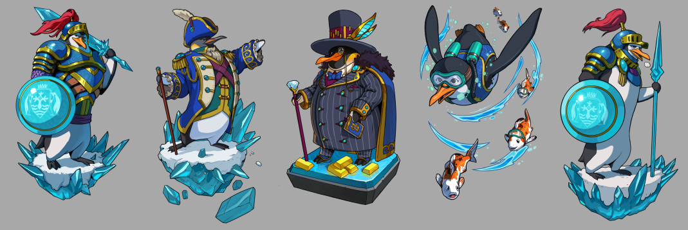

# Penguindale

The Penguindale are penguin-folk of Sky's frozen reaches: communal, hardy, and shaped by
scarcity, ritual, and the practical demands of life in the cold.

### Physical Characteristics

- Anthropomorphic penguin-like people of varying penguin species.
- Roughly 3 feet tall, sturdy, and well adapted to severe cold.
- Black-and-white feathering with colorful markings around the beak or eyes.

### Culture and Society

Penguindale life is communal and ceremonial. Loyalty, bravery, storytelling, and collective
survival matter more than personal grandeur. Festivals, oral tradition, and performance are
not luxuries for them; they are how memory and identity are kept alive in a hard climate.

### Technology and Advancements

Their technology is practical rather than expansive. They work with the materials their
environment provides, producing durable tools, arms, armor, and diving equipment suited
to cold-water survival and polar life.

### Homelands and Environment

They live in frigid polar regions, often centered around large ice caves and other communal
cold-weather structures. Their landscape shapes almost every part of their material and
social life.

### Political Structure

Penguindale society is meritocratic. Leadership tends to follow proven capability, reliability,
and service to the community rather than pure inheritance.

### Relationships with Other Races/Factions

Penguindale are relatively insular. Their sharpest recurring tension is with neighboring Polar
Bears over fishing grounds and other scarce resources, while much of the wider Sky feels
more distant and legendary than immediate.

### Magic or Special Abilities

They are not described as an overtly magical people, but they maintain a spiritual
relationship with their environment through ritual, ancestral reverence, and elemental belief.

### Additional Details

- Armis expansion into the polar regions would place direct pressure on Penguindale ways
  of life and likely turn a remote people into active defenders of their own frontier.
