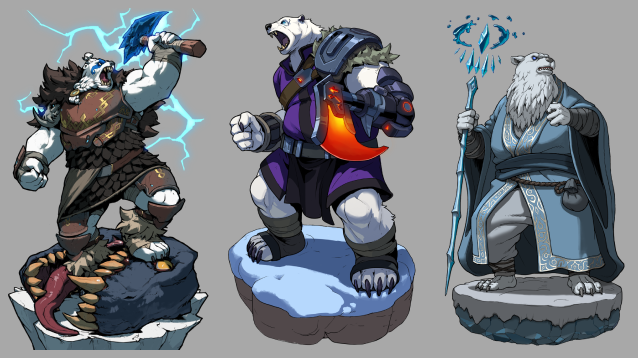

# Polar Bears

The Polar Bears are massive northern fisher-hunters whose culture values endurance,
territorial memory, and the blunt honesty required to survive where warmth is scarce.

### Physical Characteristics

- Towering bear-like people built for cold, weight, and brute physical labor.
- Heavy fur, dense muscle, and thick frames suited to ice, sea wind, and long winters.
- Their gear tends toward durable hide, bone, harpoons, and cold-weather war tools rather than ornament.

### Common Traits

- Direct, stubborn, and difficult to intimidate once a position has been taken.
- Strongly protective of kin, fishing territory, and ancestral routes.
- Slow to trust, but not deceptive by temperament.

### Culture and Society

Polar Bear society is built on survival through strength, memory, and reciprocity. A people
that lives this far north cannot afford theatrical politics for long. Food stores, migratory
patterns, hunting rights, and shelter matter more than prestige detached from practical use.
That gives them a reputation for bluntness, but their culture is not crude. They maintain a
serious ethic of provision: leaders are expected to keep others fed, guarded, and capable of
lasting through the winter. Respect is earned through reliability, not charm.

### Technology and Advancements

Their technology is pragmatic and environment-driven: icecraft, hunting tools, heavy cold-
weather armor, shelter engineering, and the material knowledge needed to live where lesser
peoples would freeze or starve. They are not an expansive technological power, but they are
experts in extracting life from severe conditions.

### Homelands and Environment

They dominate coasts, ice shelves, frozen inlets, and hunting grounds across the polar reaches
of Sky. Their settlements are built where access to food, defensible shelter, and seasonal
movement all intersect.

### Political Structure

Polar Bear leadership appears clan-based and competence-driven. Authority rests with those
who can protect routes, settle disputes, and keep communities alive through lean years.
Prestige without provisioning power does not last long among them.

### Relationships with Other Races/Factions

Their closest recurring tensions are with Penguindale, especially over fishing grounds,
migration corridors, and the practical terms of living side by side in finite polar spaces. The
Valkyrn are treated with wary respect: half as broken nobility, half as dangerous reminders of
Cryogen's old order. Outsiders often read the Polar Bears as simple bruisers, which is one of
the easiest ways to misjudge them.

### Magic or Special Abilities

They are more strongly associated with stamina, weather-hardiness, and embodied strength
than with overt ceremonial magic. When they do draw on elemental power, it is usually tied to
ice, endurance, and the authority of the hunting elder rather than to flashy spellcraft.
