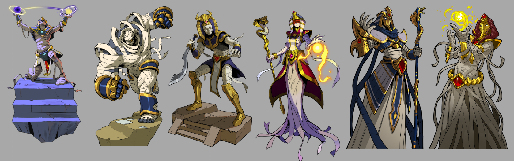

# Royal Mummies

The Royal Mummies of Rashida are revered undead rulers whose service to their people
continues after death. Unlike cursed or corrupted undead, they are sacred preservers of
memory, lineage, and protection within Rashida's spiritual order.

### Physical Characteristics

- Obsidian-blue skin or preserved bodies adorned with gold and jewels.
- Regal wrappings, ceremonial markings, and funerary ornamentation.
- A visual identity tied to Rashidan royalty, burial rites, and sacred authority.

### Common Traits

- Loyalty to Rashida and to the continuity of its royal line.
- Deep association with ritual, memory, and dynastic duty.
- Power over light-, life-, and death-adjacent magic.

### Culture and Society

The Royal Mummies are not ordinary undead. They are former rulers who have been
ritually preserved so they may continue to guard Rashida beyond death. In the source,
they function as sacred ancestors: honored, consulted, and woven into the kingdom's
understanding of rulership itself.

### Geography and Environment they Inhabit

They rest in grand tombs, mausoleums, and ceremonial burial complexes across Rashida.
These spaces are not merely memorials; they are active sites of reverence, ritual, and
political-spiritual continuity.

### Political Structure

The Royal Mummies hold symbolic and advisory authority. They do not replace the living
ruler, but they remain part of the legitimacy of the state, acting as ancestral guardians and
sources of guidance in times of crisis.

### Relationships with Other Races/Factions

They are revered by the people of Rashida and closely tied to the Net'jer and the broader
sacred order built around Kha Meht. Their presence reinforces the idea that Rashida's
past is never entirely gone; it continues to watch over the present.

### Magic or Special Abilities

The Royal Mummies display strong affinity with Light and life-death ritual magic. Their
power is preservational and ceremonial as much as martial, linking rulership, protection,
and sacred continuity.

### Notable Figure

- Pharonis, the first king of Rashida, is still said to remain among them.
