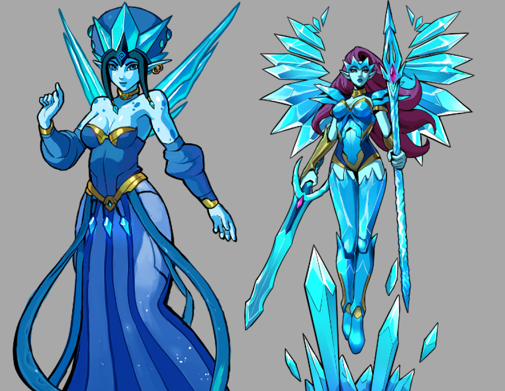

# Valkyrn

The Valkyrn are the broken remnants of a once-great people bound to Cryogen, the Water
Dragon. Their history is defined by loyalty, collapse, and survival after a catastrophic
rupture with the power they once served.

### Physical Characteristics

- Bright blue skin and ice-crystal wings.
- Blue-and-gold clothing and armor with an austere, noble visual language.
- Swift, resilient, and more elegant than overtly imposing.

### Common Traits

- Marked by memory, loss, and the shadow of their former glory.
- Often distant with strangers and wary of attachment.
- Survivors loyal to Cryogen are still depicted as rigidly obedient.

### Culture and Society

The Valkyrn were once a civilization closely tied to Cryogen during an earlier era of that
dragon's rule. When Cryogen's nature turned cruel and destructive, some Valkyrn resisted,
and that resistance appears to have shattered their society. Most were killed. Those who
remain are either refugees, loyalists, or haunted descendants of a ruined order.

### Technology and Advancements

Much of their culture's earlier refinement seems to have been lost with their downfall.
Elegant ice-based construction and status-marked architecture still point to a once-
sophisticated civilization.

### Geography and Environment they Inhabit

Modern Valkyrn are scattered across frozen regions of Sky, often living in seclusion or as
small refugee communities among other peoples. Their connection to snow, ice, and the
memory of Cryogen still defines them even without a unified homeland.

### Political Structure

They once had a hierarchy shaped by service to Cryogen and by figures known as the
Chosen, who conveyed the dragon's will. That formal structure appears to have collapsed
with the fall of their old order.

### Relationships with Other Races/Factions

Other peoples remember the Valkyrn through the lens of their connection to Cryogen,
which leaves them feared, mistrusted, or mythologized. Some polar peoples still treat
them with awe or wary respect.

### Magic or Special Abilities

The Valkyrn have strong affinity for ice and water magic. Their powers reflect both their
former closeness to Cryogen and the survival demands of the frozen regions they now
inhabit.
